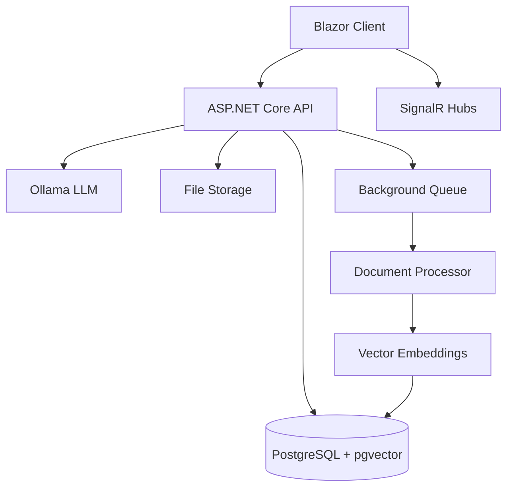

# Clevor Docs - Enhanced Project Structure

## High-Level Architecture



## Enhanced Project Structure

```
CleverDocs/
├── src/
│   ├── CleverDocs.API/                     # Web API Layer (Minimal APIs)
│   │   ├── Features/                       # Feature-based organization
│   │   │   ├── Auth/                       # Authentication feature
│   │   │   │   ├── Endpoints/              # Minimal API endpoints
│   │   │   │   ├── Models/                 # Request/response DTOs
│   │   │   │   ├── Services/               # Feature services
│   │   │   │   └── Validators/             # FluentValidation validators
│   │   │   ├── Workspaces/                 # Workspace management
│   │   │   ├── Documents/                  # Document management
│   │   │   └── Chat/                       # Chat functionality
│   │   ├── Common/                         # Cross-cutting concerns
│   │   │   ├── Middleware/                 # Custom middleware
│   │   │   ├── Filters/                    # Action filters
│   │   │   └── Behaviors/                  # MediatR behaviors
│   │   └── Program.cs                      # Application entry point
│   │
│   ├── CleverDocs.Client/                  # Blazor Frontend
│   │   ├── Features/                       # Feature-based organization
│   │   │   ├── Chat/                       # Chat feature
│   │   │   │   ├── Components/             # Reusable components
│   │   │   │   ├── Pages/                  # Full page components
│   │   │   │   ├── Services/               # Feature services
│   │   │   │   └── Models/                 # Feature models
│   │   │   ├── Documents/                  # Document management
│   │   │   └── Workspaces/                 # Workspace management
│   │   └── Shared/                         # Shared components
│   │       ├── Layout/                     # Layout components
│   │       ├── Common/                     # Common components
│   │       ├── Hooks/                      # Custom hooks
│   │       └── Utils/                      # Utility functions
│   │
│   ├── CleverDocs.Domain/                  # Domain Layer
│   │   ├── DocumentProcessing/             # Document processing domain
│   │   │   ├── Entities/                   # Document processing entities
│   │   │   ├── ValueObjects/               # Processing-specific value objects
│   │   │   ├── Enums/                      # Processing enums (e.g., ProcessingStatus)
│   │   │   ├── Events/                     # Processing domain events
│   │   │   └── Interfaces/                 # Processing repository interfaces
│   │   ├── Workspaces/                     # Workspace domain
│   │   ├── Documents/                      # Document domain
│   │   └── Users/                          # User domain
│   │
│   ├── CleverDocs.Application/             # Application Services Layer
│   │   ├── DocumentProcessing/             # Document processing services
│   │   │   ├── Commands/                   # Processing commands
│   │   │   ├── Queries/                    # Processing queries
│   │   │   ├── DTOs/                       # Processing DTOs
│   │   │   └── Interfaces/                 # Processing service contracts
│   │   ├── Services/                       # Application services
│   │   ├── DTOs/                           # Data transfer objects
│   │   ├── Interfaces/                     # Service contracts
│   │   └── Behaviors/                      # Cross-cutting concerns
│   │
│   ├── CleverDocs.Infrastructure/          # Data Access Layer
│   │   ├── DocumentProcessing/             # Document processing infrastructure
│   │   │   ├── Processors/                 # Document processors
│   │   │   ├── Extractors/                 # Text extractors
│   │   │   ├── Chunkers/                   # Document chunkers
│   │   │   ├── Embedders/                  # Text embedding generators
│   │   │   └── Services/                   # Processing services
│   │   ├── Data/                           # Database context
│   │   ├── Repositories/                   # Data access
│   │   └── Services/                       # Infrastructure services
│   │
│   └── CleverDocs.Workers/                 # Background Workers
│       ├── DocumentProcessing/             # Document processing workers
│       │   ├── Handlers/                   # Message handlers
│       │   └── Services/                   # Worker services
│       └── Common/                         # Shared worker infrastructure
│
├── tests/                                  # Test Projects
│   ├── Unit/                              # Unit tests
│   │   ├── Core/                          # Domain logic tests
│   │   ├── Application/                   # Application service tests
│   │   └── API/                           # API unit tests
│   ├── Integration/                       # Integration tests
│   │   ├── API/                           # API integration tests
│   │   ├── Database/                      # Database tests
│   │   └── ExternalServices/              # External service tests
│   └── E2E/                               # End-to-end tests
│       ├── API/                           # API E2E tests
│       └── UI/                            # UI E2E tests
│
├── config/                                # Configuration files
│   ├── appsettings.json
│   ├── appsettings.Development.json
│   └── secrets/                          # Sensitive configurations
│
├── infrastructure/                       # Infrastructure as Code
│   ├── docker/                           # Docker configurations
│   └── terraform/                        # Terraform configurations
│
└── docs/                                 # Documentation
    ├── architecture/                     # Architecture decision records
    ├── api/                              # API documentation
    └── development/                      # Development guides
```

## Key Improvements Over Previous Structure

1. **Feature-Based Organization**
   - Grouped related functionality together
   - Clearer separation of concerns
   - Easier to locate and maintain related code

2. **Enhanced Testing Structure**
   - More granular test organization
   - Clear distinction between test types
   - Better support for test automation

3. **Improved Configuration Management**
   - Dedicated config directory
   - Better secrets management
   - Environment-specific configurations

4. **Infrastructure as Code**
   - Dedicated infrastructure directory
   - Docker and Terraform configurations
   - Environment-specific setups

5. **Documentation**
   - Better organized documentation
   - Architecture decision records
   - Development guides

6. **Frontend Structure**
   - Feature-based component organization
   - Clear separation of concerns
   - Better reusability

This enhanced structure provides a more maintainable, scalable, and developer-friendly organization for the Clevor Docs platform.
